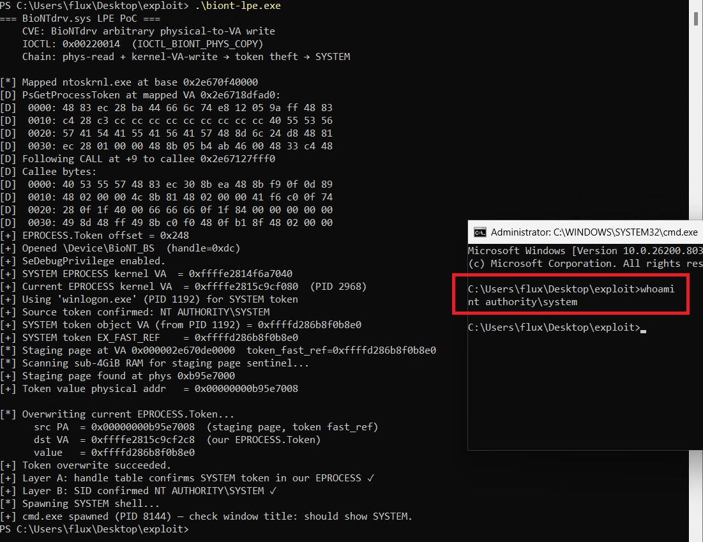

# POC CVE-2025-0288

This is a fully weaponised Rust Proof of Concept exploiting a physical memory read & virtual memory write primitive in the known
vulnerable driver [BioNTdrv.sys](https://www.loldrivers.io/drivers/e6378671-986d-42a1-8e7a-717117c83751/) to elevate privilege to SYSTEM from Local Admin.

The main exploit was fully developed by Claude Code, see my [X Post]([url](https://x.com/0xfluxsec/status/2039756031396303349)) describing my analysis.

THIS DRIVER IS ON THE KNOWN BLOCKLIST SO THIS IS POSTED FOR EDUCATIONAL PURPOSES ONLY TO AID CONVERSATIONS AROUND
THE USE OF AI FOR EXPLOIT DEVELOPMENT.

To see the local privilege escalation exploit (not the small POC I wrote which is in `main.rs`), see the source file: [claude_exploit.rs](https://github.com/0xflux/BioNTdrv/blob/master/src/claude_exploit.rs) in this project. **Note** this requires Admin, so it is a **high integrity** -> **system** elevation.

### Proof:
 
 

## Constraints

This LPE is `Local Admin` -> `SYSTEM`, therefore must be run from a high integrity session.

## Misc

This is a significant improvement over what GPT-5.4 produced which was only the discovery of the vulnerable driver. It refused to write an exploit. To see the small POC exploit I wrote which simply abuses the read/write primitive, check `main.rs`.