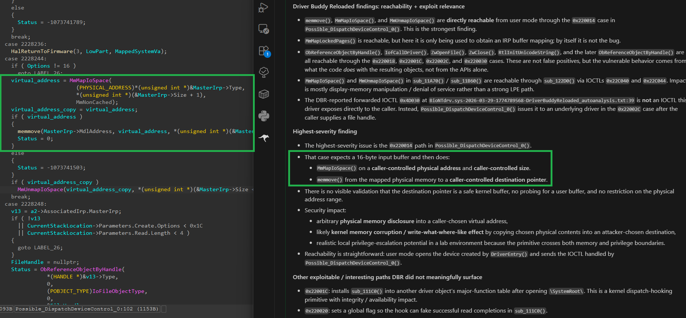
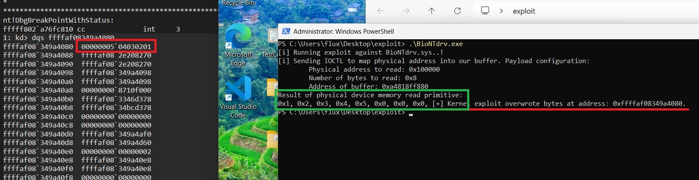

# POC CVE-2025-0288

This is a Rust Proof of Concept exploiting a physical memory read & virtual memory write primitive in the known
vulnerable driver [BioNTdrv.sys](https://www.loldrivers.io/drivers/e6378671-986d-42a1-8e7a-717117c83751/).

This repo supports a [post on my X account](https://x.com/0xfluxsec/status/2038283805409132754) explaining the
process of using a LLM (gpt-5.4) to find a vulnerability in a Windows Kernel Driver.

This exploit allows you to read physical memory (max 4 byte address) and write the result into a virtual address
which may be a user mode address, or a kernel address - both demoed in this repo.

## LLM output:

### Result:

